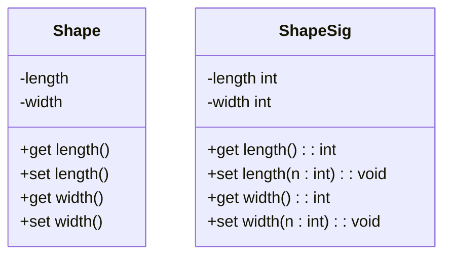
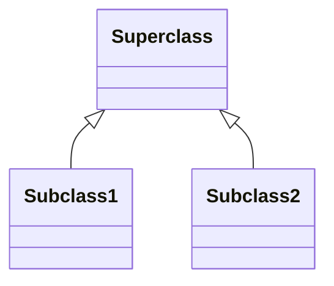

#sample uml diagram for CSC102 by Glenn Truett 
#JamTruet@uat.edu

create a diagram with 2 classes. Those classes need 3 attributes, 3 methods

Attributes come before properties or methods  
\+ public \- private, \# protected  

